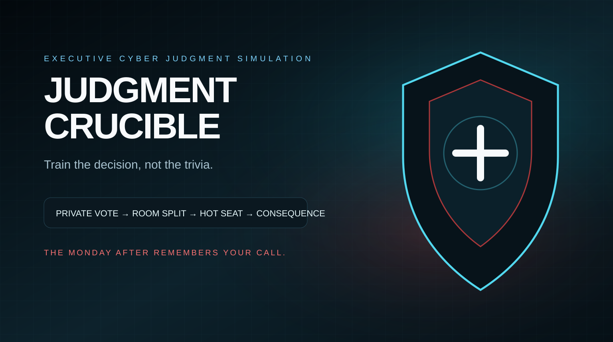
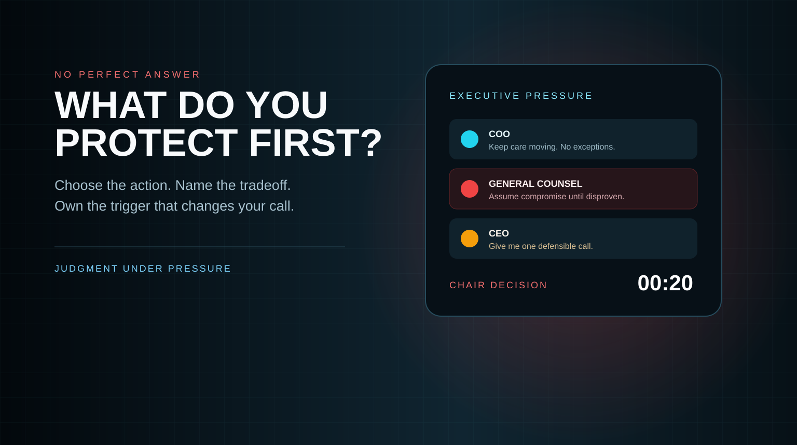

# Judgment Crucible

<p align="center">
  
</p>

<p align="center"><strong>A live, multiplayer executive judgment simulation for CISO leaders.</strong></p>

> **Repository status:** this README and the product documentation are now being corrected on `main`. The application source migration from the supplied backup is not yet complete on `main`. I am deliberately stating that here because this repository should not imply a production deployment or validated GitHub build until the source, automated tests, and runtime screenshots are actually present and passing in this repository.

Judgment Crucible is designed as a Jackbox-style leadership simulation for cybersecurity executives. One facilitator runs the session, one shared display becomes the boardroom, and everyone else joins from a phone. Participants make private decisions under time pressure, the room sees where executive judgment diverges, and one person is placed in the hot seat to make and defend the final call.

This is not cyber trivia and it is not intended to reward memorization of a single “correct” incident-response answer. The training objective is executive judgment: making a defensible call with incomplete evidence, competing priorities, limited time, organizational pressure, and consequences that can emerge later.

---

## What the experience is meant to teach

Real CISO decisions are rarely clean. During a serious incident, a leader may be balancing patient or customer impact, operational continuity, legal exposure, revenue, containment, evidence quality, executive confidence, regulatory expectations, and uncertainty at the same time.

Judgment Crucible turns those tensions into a multiplayer learning experience.

Each Chair decision is structured around five commitments:

1. **Action** — What are you authorizing right now?
2. **Protected priority** — What are you intentionally protecting first?
3. **Accepted tradeoff** — What cost, risk, or exposure are you knowingly accepting?
4. **Reconsideration trigger** — What new fact would cause you to change course?
5. **Accountable owner** — Who owns the next action or the residual risk?

That matters because a decision is more useful when the room can understand not only *what* was chosen, but *why*, *what was sacrificed*, *what would change the decision*, and *who owns what happens next*.

---

## Core game loop

```text
Facilitator creates a room
        │
        ▼
Participants scan QR / enter room code
        │
        ▼
Scenario state appears on the shared display
        │
        ▼
Everyone commits a PRIVATE vote on a phone
        │
        ▼
Voting closes
        │
        ▼
The room sees the aggregate split — not person → vote attribution
        │
        ▼
Competing executive pressure is introduced
        │
        ▼
One participant becomes THE CHAIR
        │
        ▼
20-second executive commitment
        │
        ▼
Action + priority + tradeoff + trigger + owner
        │
        ▼
Immediate consequence
        │
        ▼
Decision debt can carry into later calls
        │
        ▼
The Monday After / executive debrief
```

The important design principle is **commit before consensus**. Participants make their first judgment privately so the loudest voice in the room cannot rewrite everyone else's memory of what they initially believed.

---

## Commercial visual direction

<p align="center">
  
</p>

The product visual language is intentionally closer to an executive cyber command room than a training portal:

- dark cinematic boardroom presentation,
- restrained cyan / warning-red telemetry,
- oversized countdown moments,
- clear room-state hierarchy,
- pressure statements from executive stakeholders,
- minimal interaction on participant phones,
- strong contrast for projector and conference-room use,
- no cartoon-game treatment that undermines the seriousness of the discussion.

### Runtime screenshots

Actual application screenshots must come from the running build, not from concept artwork. The intended README screenshot set is:

- landing / product positioning,
- facilitator lobby and room creation,
- shared room voting split,
- Chair hot-seat phone experience,
- consequence reveal,
- Monday After / debrief.

Those PNGs are **not currently present on `main`**, so this README does not falsely label the commercial artwork above as application screenshots. Once the application source is fully published and the browser suite runs in GitHub, the screenshots should be generated automatically from the real build and embedded here.

---

## Product surfaces

The application architecture uses separate experiences for the facilitator, shared room, and participants.

| Route | Audience | Purpose |
| --- | --- | --- |
| `/` | Buyers / participants | Product landing, explanation, and entry points |
| `/host` | Facilitator | Create rooms, control pacing, manage voting, assign Chair, reveal consequences |
| `/room?code=ABCD` | Projector / TV | Shared boardroom experience, QR join, countdown, aggregate split, pressure, consequence |
| `/play?code=ABCD` | Participant phone | Join room, ready state, private voting, Chair commitment |
| `/simulator` | Scenario author / QA | Exercise deterministic scenario paths without a live audience |
| `/privacy` | Security / buyer review | Explain the multiplayer privacy boundary in plain language |

---

## The first scenario: The Trusted Path

The supplied product backup contains a fully modeled first scenario called **The Trusted Path**.

It is designed as a sequence of escalating executive calls rather than a one-question exercise. Decisions affect future state, including hidden decision debt, so the game can expose how a choice that feels reasonable now may create a difficult Monday-after problem later.

The scenario model includes:

- four escalating calls,
- authorized decision options,
- continuity / trust / truth effects,
- executive pressure statements,
- immediate consequences,
- conditional delayed consequences,
- hesitation and repeat-pattern logic,
- decision history,
- Monday-after accountability,
- deterministic scenario fixtures for testing.

The scenario should remain data-driven rather than embedded directly into React page components. That is what allows Judgment Crucible to become a platform for many executive simulations instead of a one-scenario demo.

Future scenario categories could include:

- ransomware containment vs operational continuity,
- compromised privileged access,
- third-party / supply-chain breach,
- cloud identity compromise,
- insider threat,
- destructive malware,
- data exfiltration with uncertain evidence,
- critical-vulnerability emergency change decisions,
- hospital / healthcare cyber disruption,
- public disclosure and communications pressure,
- regulatory notification timing,
- acquisition / inherited cyber risk.

---

## Recommended technical stack

The target product stack is:

- **Next.js**
- **React**
- **TypeScript**
- **Firebase App Hosting**
- **Firebase Realtime Database** for low-latency room state
- **Firebase Anonymous Authentication** for frictionless player identity
- server-authoritative game mutations
- deterministic scenario engine
- Playwright for browser / multiplayer validation

Python can still be useful later for scenario authoring tools, analytics, simulation, or AI-assisted content generation, but the primary game runtime should remain React / Next because the product is fundamentally a synchronized multi-screen browser experience.

---

## Production architecture

```text
                  JUDGMENT CRUCIBLE

                Firebase App Hosting
                         │
                  Next.js / React
                         │
          ┌──────────────┼──────────────┐
          │              │              │
       /host           /room          /play
   facilitator      shared TV       participant
          │              │              │
          └──────────────┼──────────────┘
                         │
                  Firebase Auth
                   anonymous UID
                         │
               authoritative APIs
                         │
                private game state
                         │
                deterministic engine
                         │
          sanitized realtime projection
                         │
               Firebase Realtime DB
                         │
                  subscribed clients
```

### Why Realtime Database

This game behaves more like a synchronized party game than a traditional CRUD application. Room state, countdowns, voting phases, Chair assignment, and reveals need to propagate quickly to several screens at once.

Firebase Realtime Database is a natural fit for that ephemeral synchronized state. Durable facilitator accounts, reporting history, commercial analytics, or content-management features could later use Firestore where appropriate, but the live room should optimize for simple low-latency subscriptions.

---

## Privacy and security model

A critical requirement is that **private voting must be private in the data model, not merely hidden in the UI**.

The original prototype architecture exposed enough session state that a technically sophisticated participant could potentially correlate a participant with a vote even when the screen itself did not display that relationship. The Firebase production design must remove that possibility at the server boundary.

Recommended trust domains:

```text
privateSessions/{room}
    authoritative server state
    participant identity
    individual vote attribution
    hidden scenario debt
    facilitator-only information

publicSessions/{room}
    current game phase
    safe scenario text
    participant display names / readiness
    timer state
    aggregate vote totals when revealed
    Chair identity when appropriate
    consequence text when revealed

client-local participant state
    that participant's current private selection
    device/session convenience state
```

### Security invariants

The production application should enforce all of the following:

- Another participant cannot read your individual vote.
- The shared display cannot access individual vote attribution.
- Public realtime state never contains access keys, hidden debt, internal flags, or private decision data.
- Clients cannot directly mutate authoritative room state in Realtime Database.
- Game-changing actions go through validated server routes.
- Host actions require host authorization.
- Participant actions are associated with an authenticated anonymous Firebase UID.
- Realtime Database security rules are deny-by-default outside the explicitly sanitized public projection.
- Optional Firebase App Check should be enabled for production abuse resistance.

A hidden DOM element is **not** a security control. If a screen is not entitled to know something, the server should not send it.

---

## Local development experience

The intended development workflow supports two modes.

### Zero-config local mode

A developer should be able to run the application without first provisioning Firebase. When Firebase runtime configuration is absent, the application can fall back to an atomic local session store for development and automated testing.

Expected flow:

```bash
npm install
npm run dev
```

Then:

1. Open `/host`.
2. Create a room.
3. Open the generated `/room?code=XXXX` URL in a second browser/window.
4. Open or scan `/play?code=XXXX` from one or more phones or browser contexts.
5. Join, ready, and run the scenario.

### Firebase-connected mode

Production and realistic multiplayer testing should use Firebase anonymous authentication and Realtime Database subscriptions.

---

## Firebase production setup

### 1. Create the Firebase project

Create/select a Firebase project and enable:

- Authentication → **Anonymous** sign-in
- Realtime Database
- App Hosting

### 2. Connect App Hosting to GitHub

Connect this repository to Firebase App Hosting and configure the production branch after the source build is actually validated on `main`.

### 3. Environment configuration

Typical production configuration includes:

```bash
NEXT_PUBLIC_SITE_URL=https://your-domain.example
REQUIRE_APP_CHECK=true
NEXT_PUBLIC_RECAPTCHA_ENTERPRISE_SITE_KEY=<site-key>
```

Do not commit service-account private keys. Managed Firebase hosting should use application-default credentials for server-side Firebase Admin access.

### 4. Database rules

The browser should only be able to read sanitized public session state. Browser writes to authoritative game state should be denied.

### 5. Production rehearsal

Before an executive or paid session:

- test on the actual conference-room display,
- join from multiple real phones,
- use at least one phone on a different network,
- test participant reconnect,
- test late join behavior,
- run the complete scenario,
- verify voting privacy in browser network tools,
- validate timer behavior,
- validate the Monday After sequence,
- confirm App Check after the rehearsal succeeds.

---

## Facilitator operating model

A strong first session is approximately **30–45 minutes** for **6–12 leaders**.

### Before participants arrive

1. Open the facilitator console.
2. Create a room.
3. Put the room screen on the projector / TV.
4. Confirm the QR code and room code are readable from the back of the room.
5. Join once from a real phone to validate network access.

### Start of session

Explain three rules:

- Initial decisions are private.
- There may not be a perfect answer.
- The goal is to make the decision defensible, not to guess what the facilitator thinks is correct.

### During a call

1. Let everyone read the situation.
2. Open voting.
3. Enforce the timer.
4. Close voting.
5. Reveal only the aggregate room split.
6. Introduce executive pressure.
7. Put the Chair in the hot seat.
8. Require the five-part commitment.
9. Reveal the consequence.
10. Discuss what changed in the room's reasoning.

The facilitator should avoid saying “the correct answer was...” unless a scenario is intentionally built around an objective compliance requirement. The most valuable discussion is usually *why* experienced leaders divided.

---

## Debrief philosophy

Judgment Crucible should not reduce executive leadership to a fake score such as “You are a 72% CISO.”

A sophisticated leader can make a defensible call and still receive a bad operational result. Conversely, a weak process can sometimes get lucky.

The debrief should surface patterns such as:

- continuity-first vs containment-first tendencies,
- willingness to operate under uncertainty,
- repeated deferral of accountability,
- trigger quality,
- ownership clarity,
- pressure sensitivity,
- whether the room changes its judgment after seeing peer disagreement,
- whether accepted tradeoffs are explicitly acknowledged.

Example output:

> Across four calls, the group repeatedly protected operational continuity while accepting increasing residual exposure. Reconsideration triggers became more specific as evidence quality improved, but accountable ownership remained diffuse.

That creates a useful leadership conversation without pretending the software can universally grade a CISO.

---

## Quality gates before release

A release should not be considered stable until all of these pass in the GitHub repository itself:

```bash
npm run lint
npm run typecheck
npm test
npm run validate:scenario
npm run build
npm run test:e2e
```

### Automated product/security tests should cover

- session creation,
- participant join,
- participant readiness,
- private vote submission,
- individual-vote confidentiality,
- aggregate vote reveal,
- Chair assignment,
- Chair authorization,
- structured commitment validation,
- scenario progression,
- delayed consequence logic,
- sanitized Firebase public projection,
- reconnect behavior,
- malformed request rejection.

### Browser E2E should cover

A real browser test should exercise at least one complete multiplayer path:

```text
host creates room
→ participant joins
→ participant becomes ready
→ call begins
→ participant votes privately
→ public session is inspected and vote attribution is absent
→ voting closes
→ aggregate totals appear
→ pressure state appears
→ Chair commits decision
→ consequence appears on room display
```

The same browser suite should create the README runtime screenshots so the documentation can never quietly drift into showing an obsolete mockup.

---

## Go-to-market positioning

Judgment Crucible should be sold as an **executive judgment development experience**, not another security-awareness game.

### Best-fit audiences

- CISO leadership teams
- security leadership off-sites
- aspiring / first-time CISOs
- executive cyber-risk workshops
- board and executive readiness programs
- consulting cohorts
- leadership-development programs
- healthcare cybersecurity leadership teams

### Core differentiation

> Most exercises test whether a team can identify a good cyber response. Judgment Crucible tests whether a leader can make, explain, own, and revisit a consequential decision while the room is divided and time is running out.

### Commercial modes

Potential offerings include:

- self-facilitated team license,
- facilitated executive workshop,
- annual enterprise scenario library,
- leadership cohort program,
- conference / event experience,
- consulting partner licensing,
- custom scenario authoring for enterprise clients.

### What makes it marketable

The experience is naturally demonstrable. A buyer can understand it quickly because the room split, countdown, hot seat, and consequence reveal are visible immediately. The serious executive aesthetic also matters: this must feel appropriate in a CISO off-site or executive conference room, not like a consumer quiz with cybersecurity vocabulary pasted on top.

---

## Scenario platform direction

The long-term product should treat scenarios as independently versioned content packages.

A scenario package should define:

- title and commercial description,
- learning objectives,
- target audience,
- calls / stages,
- decision options,
- pressure statements,
- immediate effects,
- hidden debt effects,
- delayed consequences,
- final debrief rules,
- deterministic fixtures,
- optional facilitator notes,
- optional sector-specific language.

That architecture lets the company build a commercial scenario catalog without forking the application for each customer.

---

## Product principles

1. **Commit before consensus.** Private initial judgment prevents groupthink from rewriting the room's memory.
2. **Pressure must be explicit.** Business, legal, operational, customer/patient, financial, and executive pressures are part of the decision.
3. **Consequences create discussion rather than declare a winner.** A defensible choice can still create pain.
4. **Accountability travels forward.** Ownership, triggers, and accepted tradeoffs survive the moment of decision.
5. **Privacy must be architectural.** Screens receive only the data they are entitled to know.
6. **The room is the product.** Projector, phones, countdown, sound, pacing, and reveal must feel intentional enough for senior executives.
7. **Scenarios are content, not UI code.** New training situations should not require rewriting multiplayer orchestration.
8. **Do not fake certainty.** The debrief should expose judgment patterns without pretending leadership can be reduced to a magic score.

---

## Definition of go-to-market ready

The project should not be described as commercially ready until all of the following are true:

- application source is present on `main`,
- dependency lockfile is committed,
- CI is green,
- production build succeeds,
- real browser E2E passes,
- Firebase security rules are tested,
- private-vote leakage tests pass,
- runtime screenshots are generated from the build,
- Firebase production environment is configured,
- custom domain is attached,
- mobile reconnect has been tested on real devices,
- facilitator guide is complete,
- at least one external pilot has been run,
- pilot feedback has been incorporated,
- privacy/security review is complete,
- incident/session logging and support procedures are defined.

That standard is intentionally higher than “the pages render.”

---

## Naming note

The GitHub repository is named **`Judgement-Crucible`**, while the product artwork and current product copy use **Judgment Crucible**. Before public launch, choose one spelling and normalize the repository, domain, application metadata, social assets, and commercial materials so customers do not encounter both versions.

---

## License / commercial use

This repository is intended for a commercial product. The presence of source or documentation in a public GitHub repository does **not** by itself grant an open-source license. Add an explicit commercial license, proprietary notice, or approved open-source license before broader distribution.

---

## Current next actions

The immediate repository work is:

1. finish publishing the supplied application source to `main`,
2. commit the production dependency lockfile,
3. run the complete GitHub Actions quality gate,
4. fix every failing lint/type/build/E2E test,
5. generate genuine runtime screenshots from the passing build,
6. replace this status notice with verified build/deployment badges,
7. connect the production Firebase project,
8. perform a real-device multiplayer rehearsal,
9. deploy the first pilot environment.

Until those steps are complete, the README should describe the product direction and architecture accurately without claiming that GitHub contains a stable deployed release that it does not yet contain.
