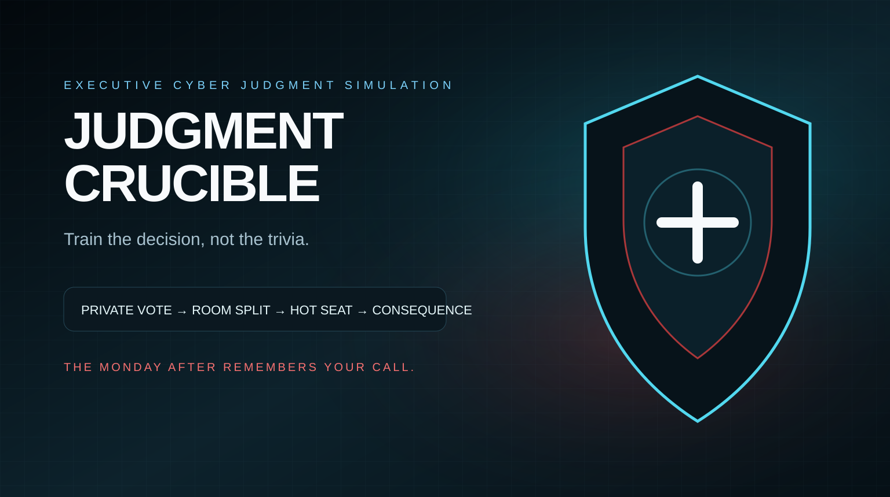
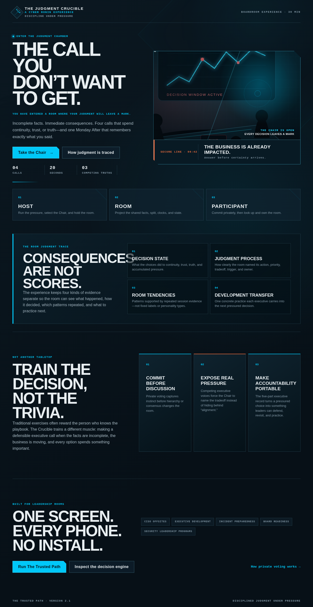
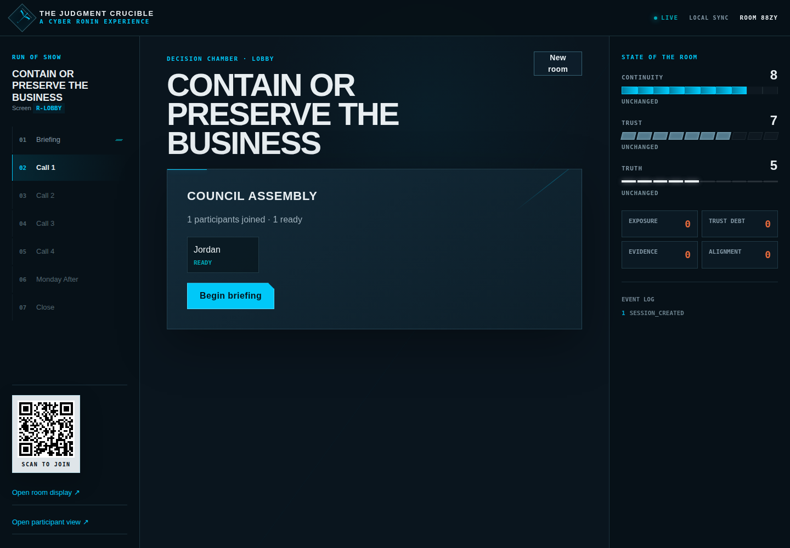
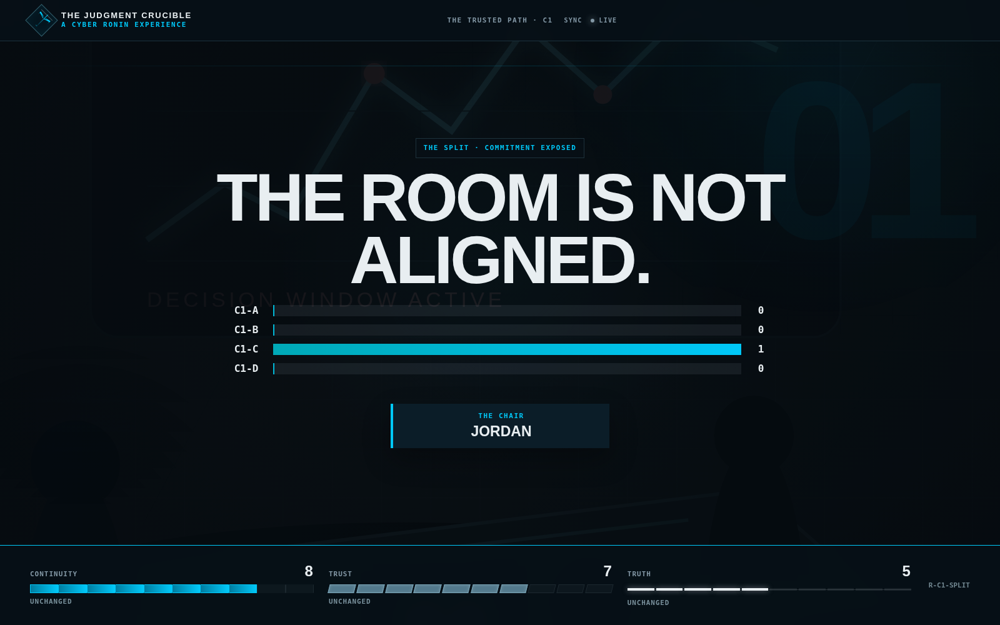
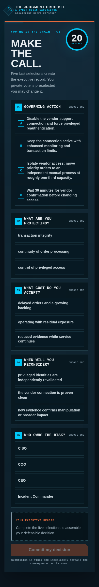

# Judgment Crucible

<p align="center">
  
</p>

<p align="center"><strong>A live, multiplayer executive judgment simulation for CISO leaders.</strong></p>

Judgment Crucible is not a cyber trivia game and it is not another tabletop exercise. It puts one leader in the hot seat while the rest of the room commits privately, exposes where executive judgment diverges, then forces a timed, defensible decision under incomplete information and competing business pressure.

One facilitator runs the session. One shared screen becomes the boardroom. Everyone else joins from a phone — no player account, app install, or special controller required.

## Product tour

| Landing / positioning | Facilitator console |
| --- | --- |
|  |  |

| Shared room reveal | Chair phone experience |
| --- | --- |
|  |  |

> The screenshots above are generated from the production build by Playwright in CI. They are documentation artifacts, not design mockups.

## Why this exists

CISO leadership is rarely a matter of selecting the technically perfect answer. Real incidents force leaders to decide while evidence is incomplete, revenue is exposed, operations are degrading, executives disagree, lawyers are cautious, and the clock keeps moving.

Judgment Crucible trains that decision layer.

Each call forces the Chair to record five things:

1. **Action** — what are you authorizing now?
2. **Protected priority** — what are you intentionally protecting?
3. **Accepted tradeoff** — what cost or exposure are you accepting?
4. **Trigger** — what new fact would cause you to reconsider?
5. **Owner** — who owns the next action or residual risk?

The room sees consequences, not a simplistic “correct/incorrect” grade. Earlier decisions can create debt that returns later in the scenario. The final debrief focuses on patterns of judgment, pressure migration, accountability, and defensibility rather than pretending the game can calculate a universal CISO score.

## The live game loop

```text
Facilitator opens a room
        │
        ▼
Players scan QR / enter 4-character code
        │
        ▼
Situation appears on the shared display
        │
        ▼
Everyone commits a private vote on a phone
        │
        ▼
The room split is revealed — aggregate only
        │
        ▼
Competing executive pressure is introduced
        │
        ▼
One participant becomes THE CHAIR
        │
        ▼
20-second structured executive commitment
        │
        ▼
Immediate consequence + persistent decision debt
        │
        ▼
Next call → Monday After → executive debrief
```

## Experience surfaces

| Route | Audience | Purpose |
| --- | --- | --- |
| `/` | Buyers / participants | Commercial product landing and session entry points |
| `/host` | Facilitator | Create rooms, control pacing, assign the Chair, close voting, reveal consequences |
| `/room?code=ABCD` | Shared display | Projector/TV experience, timers, QR join, aggregate vote split, scenario reveals |
| `/play?code=ABCD` | Participant phone | Join, ready, private vote, Chair decision, final personal commitment |
| `/simulator` | Scenario designer / QA | Deterministically exercise scenario paths without a live room |
| `/privacy` | Buyers / security review | Plain-language explanation of the multiplayer privacy boundary |

## Quick start — local demo

Requirements:

- Node.js **22.13+**
- npm 10+

```bash
npm install
npm run dev
```

Then:

1. Open `http://localhost:3000/host` and create a session.
2. Open the room URL shown in the facilitator console on a second browser or presentation display.
3. Scan the QR code from a phone, or open the `/play?code=...` URL.
4. Join, mark ready, and start the scenario from the host console.

No Firebase account is required for local evaluation. If Firebase runtime configuration is absent, the server automatically uses an atomic local JSON store under `.local-data/` and clients use the API fallback transport.

## Production architecture

Judgment Crucible is a **Next.js 16 / React 19 / TypeScript** application designed for **Firebase App Hosting**.

```text
┌──────────────────────┐        ┌──────────────────────┐
│ Facilitator browser  │        │ Shared room display  │
│ /host                │        │ /room                │
└──────────┬───────────┘        └──────────┬───────────┘
           │                               │
           ├──────────────┬────────────────┤
           │              │                │
           ▼              ▼                ▼
      Next.js API     Firebase Auth   Realtime Database
      authoritative   anonymous UID   sanitized live feed
      game actions                      publicSessions/
           │
           ▼
    privateSessions/
  authoritative state only
           │
           ▼
   deterministic game engine
        shared/game.ts
           │
           ▼
  scenario package / fixtures
   spec/trusted-path-v2/
```

The critical design principle is that **realtime does not mean public**.

- `privateSessions/{room}` holds authoritative state and is never readable directly by a browser.
- `publicSessions/{room}` contains a sanitized projection appropriate for all authenticated participants.
- Individual vote attribution is removed at the server boundary before public state is written.
- The facilitator sees counts and aggregate vote distribution when it is appropriate to reveal them, not `person → vote` mappings.
- Each production phone receives an anonymous Firebase Auth identity; there is no participant registration ceremony.
- Firebase App Check can be required in production with one environment flag.

See [docs/ARCHITECTURE.md](docs/ARCHITECTURE.md) and [SECURITY.md](SECURITY.md) for the full trust model.

## Deploy to Firebase App Hosting

### 1. Create the Firebase project

In Firebase:

- Create or select a project.
- Enable **Authentication → Anonymous** sign-in.
- Create a **Realtime Database** in the desired region.
- Deploy the included database rules.
- Create an **App Hosting** backend and connect this GitHub repository.

### 2. Deploy Realtime Database rules

Using the Firebase CLI from an authenticated workstation:

```bash
npm install -g firebase-tools
firebase login
firebase use <your-project-id>
firebase deploy --only database
```

The included [`database.rules.json`](database.rules.json) deliberately allows browser reads only from sanitized public session state. Browser writes to game state are denied; mutations go through the authoritative Next.js API.

### 3. App Hosting configuration

[`apphosting.yaml`](apphosting.yaml) already defines production runtime sizing. Firebase App Hosting supplies its Firebase web configuration automatically. For a manually hosted environment, copy `.env.example` and provide the public Firebase web configuration.

Recommended production variables:

```bash
REQUIRE_APP_CHECK=true
NEXT_PUBLIC_RECAPTCHA_ENTERPRISE_SITE_KEY=<site-key>
NEXT_PUBLIC_SITE_URL=https://your-domain.example
```

Do **not** place service-account private keys in `.env` for Firebase App Hosting. The server uses Firebase Admin's application-default credentials in the managed runtime.

### 4. Custom domain and rehearsal

Before a paid or executive session:

- attach the intended custom domain,
- verify the room display on the actual projector/TV,
- join from at least two real phones on a different network,
- run the complete Trusted Path scenario once,
- confirm App Check is enabled after the rehearsal succeeds.

See [docs/DEPLOYMENT.md](docs/DEPLOYMENT.md) for the production checklist.

## Running a session

A good first facilitated session is 30–45 minutes for 6–12 leaders.

**Facilitator setup**

1. Open `/host` on the facilitator laptop.
2. Create a new room.
3. Put `/room?code=XXXX` on the presentation display.
4. Let participants scan the QR code and join with a display name.
5. Wait until the room is ready, then start.

**During each call**

1. Give the room time to read the incident state.
2. Open private voting and enforce the countdown.
3. Close voting; the projector reveals only the aggregate split.
4. Introduce the executive pressure layer.
5. Assign or rotate the Chair.
6. The Chair commits the five-part executive record from their phone.
7. Read the consequence before discussing it.
8. Advance only after the room explains what changed in its reasoning.

The game works best when the facilitator avoids turning the consequence into “the answer.” The purpose is to expose the quality and assumptions of the decision.

A printable facilitation flow is in [docs/FACILITATOR-GUIDE.md](docs/FACILITATOR-GUIDE.md).

## Scenario model

The shipping scenario, **The Trusted Path**, lives in [`spec/trusted-path-v2`](spec/trusted-path-v2/). It is intentionally data-driven rather than embedded in page components.

It includes:

- four escalating executive calls,
- authorized decision options,
- continuity / trust / truth effects,
- hidden decision debt,
- conditional consequences,
- hesitation and repeat-pattern rules,
- Monday-after accountability,
- deterministic test fixtures,
- experience fixture definitions,
- visual tokens.

Validate it independently:

```bash
npm run validate:scenario
```

Additional scenarios should follow the same package model so new content can be reviewed and tested without rewriting multiplayer orchestration. See [docs/SCENARIO-AUTHORING.md](docs/SCENARIO-AUTHORING.md).

## Quality gates

The repository treats a build as releasable only after all of these pass:

```bash
npm run lint
npm run typecheck
npm test
npm run validate:scenario
npm run build
npm run test:e2e
```

`npm run validate` runs the static, unit, scenario, and production-build gates together.

The Playwright suite additionally verifies a real multiplayer path:

- create session,
- join participant,
- ready participant,
- begin call,
- submit private vote,
- assert the vote is **not** exposed in public session data,
- close voting,
- assert only aggregate totals are revealed,
- advance through pressure and Chair state,
- commit the structured Chair decision,
- assert the shared room receives the consequence.

GitHub Actions runs these gates on the production Node runtime and generates the README screenshots from the same built application.

## Security and privacy design

The first rule of the multiplayer design is simple: **a hidden DOM element is not a privacy boundary**.

Participant votes are stripped from public and facilitator session projections in `shared/game.ts`. Production API requests are authenticated with Firebase anonymous identity tokens, and optional App Check verification is available for abuse resistance. Realtime Database rules deny browser writes to authoritative state.

Read [SECURITY.md](SECURITY.md) before changing session serialization, vote handling, database rules, or authentication.

## Go-to-market posture

The application is designed to be sold and facilitated as an executive development experience rather than positioned as a generic cyber game.

**Best-fit audiences**

- CISO leadership teams
- security leadership off-sites
- aspiring / first-time CISOs
- executive cyber-risk workshops
- board and executive readiness programs
- consulting or leadership-development cohorts

**Core differentiator**

> Most exercises test whether a team can identify a good cyber response. Judgment Crucible tests whether a leader can make, explain, own, and revisit a consequential decision while the room is divided and time is running out.

The experience intentionally avoids an opaque individual “CISO score.” That makes the output more defensible for executive education and more useful for facilitated discussion.

A pilot-to-launch checklist is in [docs/PILOT-AND-GTM.md](docs/PILOT-AND-GTM.md).

## Repository map

```text
app/                         Next.js routes and product UI
app/components/              Main multiplayer client experiences
lib/firebase/                Firebase Admin/client integration
lib/session-store.ts         Private/public persistence boundary
lib/request-guards.ts        Production participant authorization
shared/game.ts               Deterministic game and projection engine
spec/trusted-path-v2/        Scenario package and validation fixtures
tests/                       Fast product/security tests
e2e/                         Browser + multiplayer Playwright validation
docs/                        Facilitation, deployment, architecture, GTM
public/                      Brand imagery and validated screenshots
.github/workflows/ci.yml     Release quality gates
```

## Product principles

1. **Commit before consensus.** Private initial judgment prevents the loudest voice from rewriting the room's memory.
2. **Pressure must be explicit.** Revenue, patient/customer impact, legal exposure, uncertainty, and executive pressure are part of the decision — not background flavor.
3. **Consequences should create discussion, not declare a winner.** A defensible choice can still produce pain.
4. **Accountability travels forward.** Ownership, triggers, and accepted tradeoffs should survive the moment of decision.
5. **Privacy must be architectural.** The server should not send data a screen is not entitled to know.
6. **The room is the product.** The projector, the phones, the countdown, and the reveal must feel intentional enough for an executive audience.

---

**Judgment Crucible** is currently maintained as a commercial product codebase. No open-source license is granted by the presence of this public repository.
